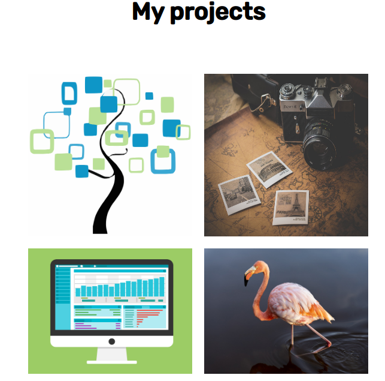

# Portfolio website
The Portfolio website was created in order to present my four projects, show used technologies and provide contact informations to users.

**Table of Contents**

- [Portfolio website](#portfolio-website)
  * [Setup](#setup)
  * [Technologies](#technologies)
  * [Where can I see the website](#where-can-i-see-the-website)
  * [Functionalities](#functionalities)

## Setup
To open the website properly you need to have an updated browser (Chrome recomended)

## Technologies
The website was created with usage of:
- HTML
- CSS

## Where can I see the website
The portfolio application you can [SEE HERE](https://jadwiga92.github.io/FirstProject/)
## Functionalities
The website contains a menu with 3 buttons (About, Portfolio, Contact) and a logo:

About section provides about me description:

The Portfolio section contains pictures of 4 projects and used technologies presented in a picture below:

💚If you like my website and wish to cooperate with me you must absolutely see Contact section! 💚

